# TableTop-FrontEnd

  
  
  ## Description
  
  This app was created with Virtual D&D players in mind, with this project you can meet up with friends to create a campaign or find new players within our community forum to group up with. Run or join as many campaigns as you like with our interactive campaign and character creation and track progress by adding to your inventory, proficiency and features list and update attributes. 

  Our Campaign Gameplay includes a virtual tabletop where a GM will be able to move character and NPC tokens around a map to indicate gameplay. We recommend playing through a third party video call such as Zoom or Discord where the GM is sharing their screen with the rest of the party.
  ## Table Of Contents
  
  - [Installation](#installation)
  - [Usage](#usage)
  - [Contributing](#contributing)
  - [License](#license)
  - [Credits](#credits)
  - [Creators](#creators)
  
  ## Usage

  Our app is deployed through Heroku which you can access through this [link](https://table-top-fe.herokuapp.com/) and we recommend using a Chrome Browser. Upon entering the website you will see our a navbar at the top, our logo, a brief description of the website and a sign in form. 
  If you haven't signed up there is a link in the navbar for that purpose

  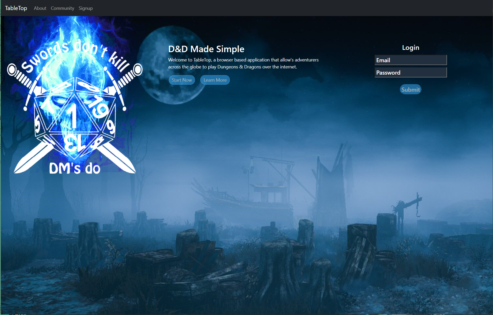 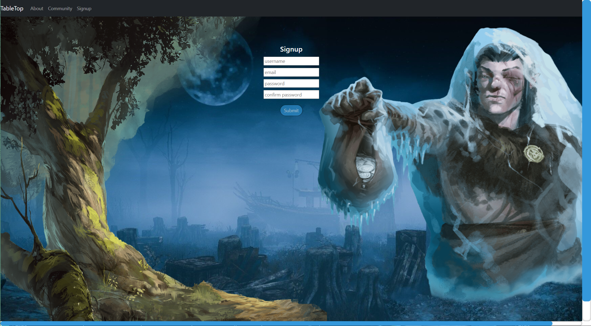  

  After signing in you can travel to your profile page and see a list of Campaigns, characters and options to create a campaign and change your user settings.

  Going into one of your campaigns you can edit the name and description if you are the GM as well as launch, delete and invite or kick players. There will be a list of all players and characters and an invite input box.
  
  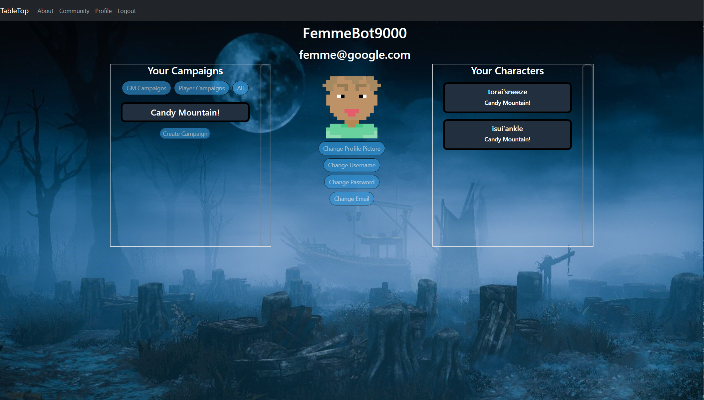 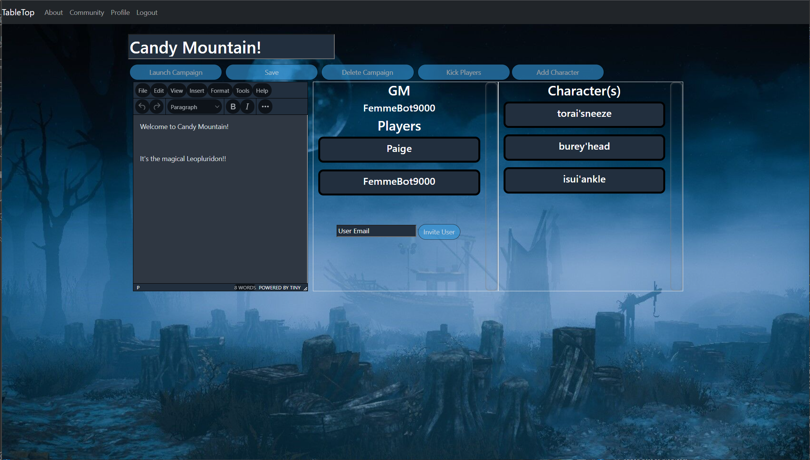  

  If you click "Add Character" you will be taken to a character creation page where you can either choose race, class and proficiencies using an API we have accessed or Homebrew your own character. 

  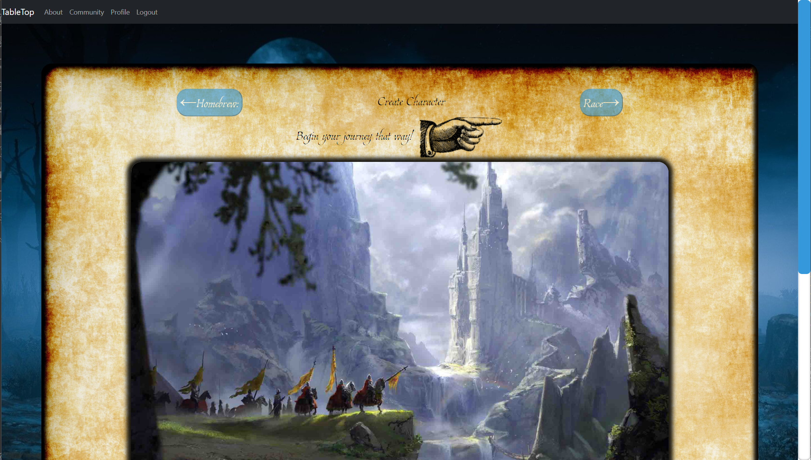   

  Through this page you can roll for attributes and HP as well as type in Personality, Background and Alignment info using the TinyMCE Editor towards the bottom

     

  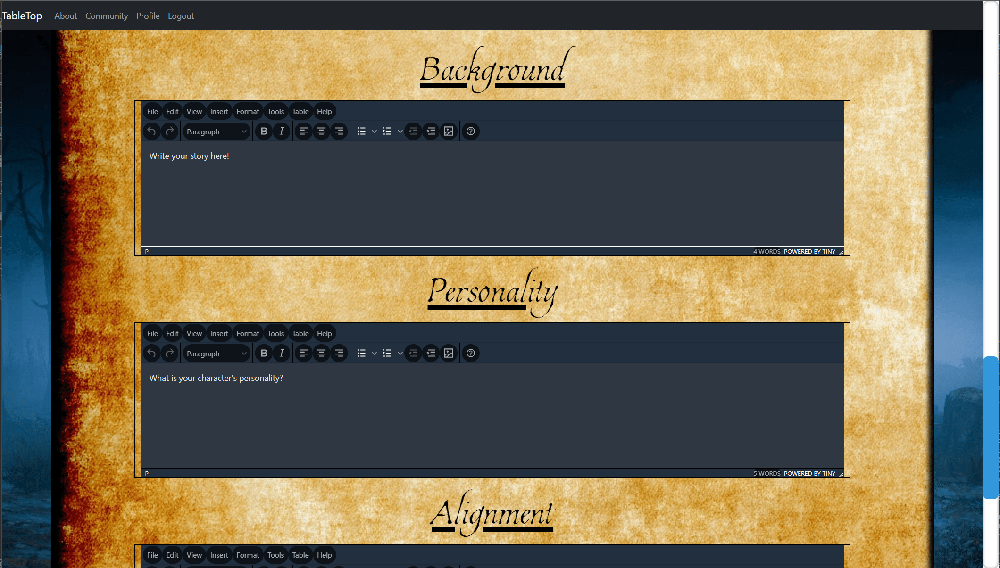  

  Once you've finished your character creation if you were to click on the character name in your profile page or the campaign page it will take you to a character view sheet. Here you can view, edit, add and delete your character information, proficiencies, features and items. 
  
  Other players can view your character view sheet but will not have the option to change anything in your character view sheet
  
  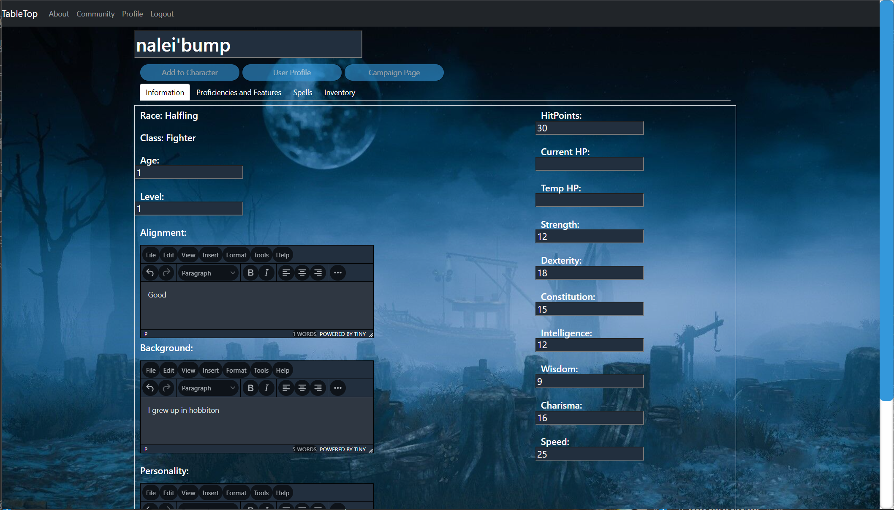 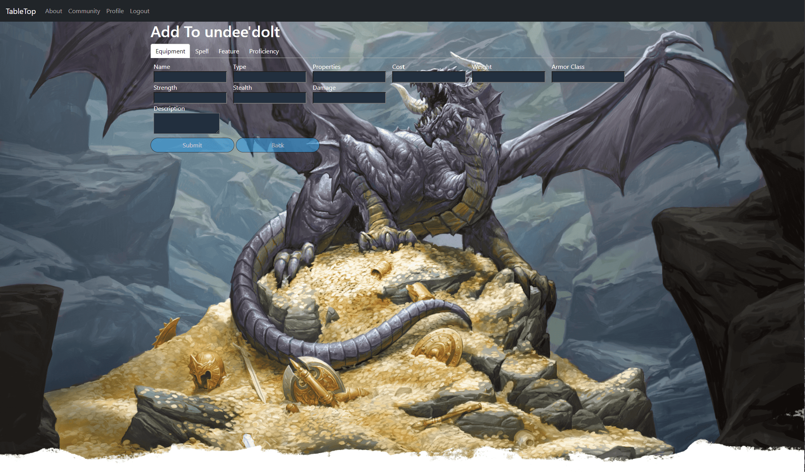  

  Once your campaign is ready to begin you can click the Launch Campaign Page and begin playing with your friends via Zoom. We recommend that the GM controls the launch page and shares their screen with the other players. 
  
  When setting up the launch page it is important to add only one character token at a time. Add a token, it will appear at the top left portion of the map, and then move that token to another spot before adding another. You do need to choose a picture and type in the name of the character before the token is created. Once all the character tokens are made an NPC can add NPC tokens at will for the players to interact with. 

  As of right now we have a single map available but plan to increase functionality by allowing GMs to upload and present their own maps. As the game progresses the GM can use the dice in the launch screen for rolls, this is very useful in case not everyone in the party has access to dice.

    

  As a new User you can also utilize the Community Forum to find players for your campaign or find a campaign to join for yourself. You would have to interact within the comments with the GM in order for them to send you an invite to their campaign.

  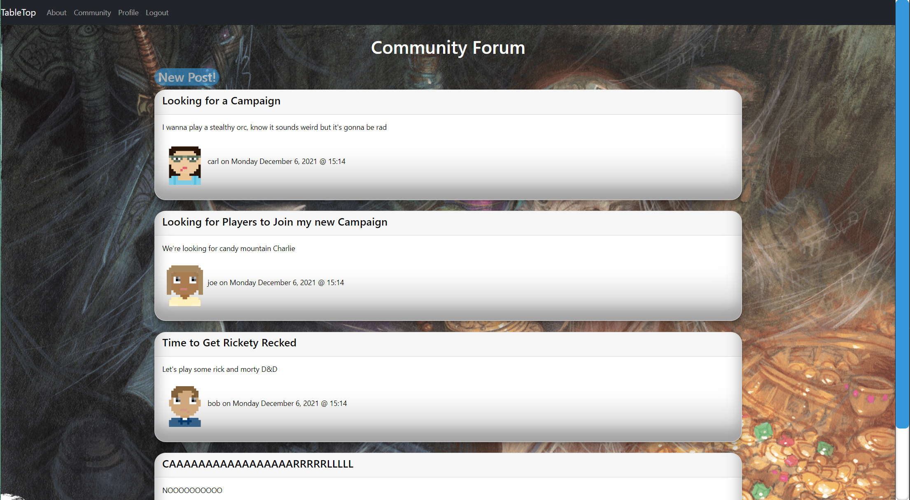 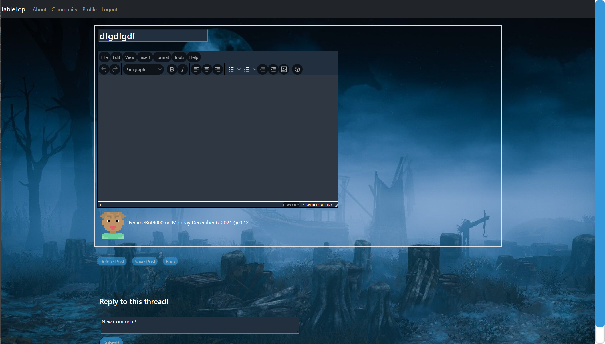  

Finally, if you view the about page you can see information about our team with links to our GitHub repos and information about our app!

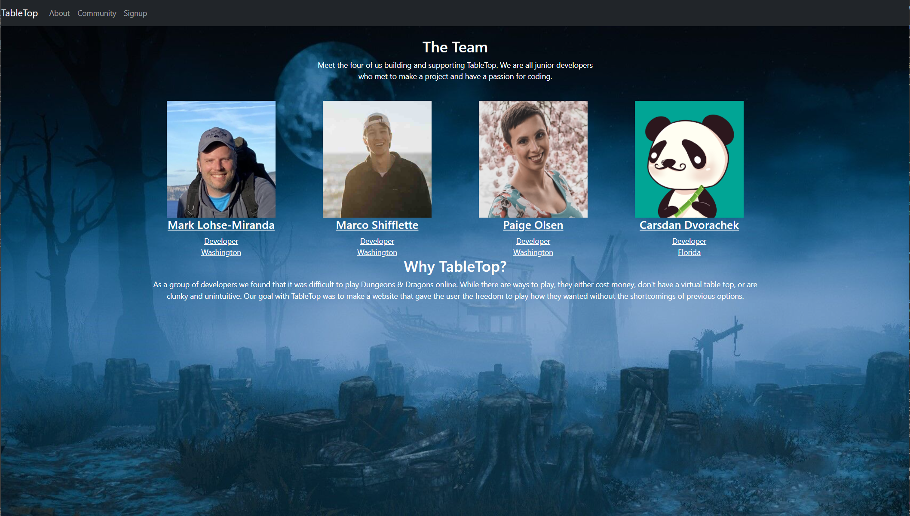  

Thank You for Your Interest and we Appreciate any feedback!

  ## Contributing

  
 
 Click to See Contributor Code of Conduct
  

  ### Contributor Covenant Code of Conduct
  
  #### Our Pledge
  
  We as members, contributors, and leaders pledge to make participation in our community a harassment-free experience for everyone, regardless of age, body size, visible or invisible disability, ethnicity, sex characteristics, gender identity and expression, level of experience, education, socio-economic status,
  nationality, personal appearance, race, caste, color, religion, or sexual identity and orientation.
  We pledge to act and interact in ways that contribute to an open, welcoming, diverse, inclusive, and healthy community.
  
  #### Our Standards
  
  Examples of behavior that contributes to a positive environment for our community include:
  
  * Demonstrating empathy and kindness toward other people
  * Being respectful of differing opinions, viewpoints, and experiences
  * Giving and gracefully accepting constructive feedback
  * Accepting responsibility and apologizing to those affected by our mistakes,
  and learning from the experience
  * Focusing on what is best not just for us as individuals, but for the
  overall community
  
  Examples of unacceptable behavior include:
  
  * The use of sexualized language or imagery, and sexual attention or
  advances of any kind
  * Trolling, insulting or derogatory comments, and personal or political attacks
  * Public or private harassment
  * Publishing others’ private information, such as a physical or email
  address, without their explicit permission
  * Other conduct which could reasonably be considered inappropriate in a
  professional setting
  
  #### Enforcement Responsibilities
  
  Community leaders are responsible for clarifying and enforcing our standards of acceptable behavior and will take appropriate and fair corrective action in response to any behavior that they deem inappropriate, threatening, offensive, or harmful.
  Community leaders have the right and responsibility to remove, edit, or reject comments, commits, code, wiki edits, issues, and other contributions that are not aligned to this Code of Conduct, and will communicate reasons for moderation decisions when appropriate.
  
  #### Scope
  
  This Code of Conduct applies within all community spaces, and also applies when an individual is officially representing the community in public spaces. Examples of representing our community include using an official e-mail address, posting via an official social media account, or acting as an appointed representative at an online or offline event.
  
  #### Enforcement
  
  Instances of abusive, harassing, or otherwise unacceptable behavior may be reported to the community leaders responsible for enforcement at Paige.El.Olsen@gmail.com. All complaints will be reviewed and investigated promptly and fairly. All community leaders are obligated to respect the privacy and security of the reporter of any incident.
  
  #### Enforcement Guidelines
  
  Community leaders will follow these Community Impact Guidelines in determining the consequences for any action they deem in violation of this Code of Conduct:
  1. Correction
      - Community Impact: Use of inappropriate language or other behavior deemed unprofessional or unwelcome in the community.
      - Consequence: A private, written warning from community leaders, providing clarity around the nature of the violation and an explanation of why the behavior was inappropriate. A public apology may be requested.
  2. Warning
      - Community Impact: A violation through a single incident or series of actions.
      - Consequence: A warning with consequences for continued behavior. No interaction with the people involved, including unsolicited interaction with those enforcing the Code of Conduct, for a specified period of time. This includes avoiding interactions in community spaces as well as external channels like social media. Violating these terms may lead to a temporary or permanent ban.
  3. Temporary Ban
      - Community Impact: A serious violation of community standards, including sustained inappropriate behavior.
      - Consequence: A temporary ban from any sort of interaction or public communication with the community for a specified period of time. No public or private interaction with the people involved, including unsolicited interaction with those enforcing the Code of Conduct, is allowed during this period. Violating these terms may lead to a permanent ban.
  4. Permanent Ban
      - Community Impact: Demonstrating a pattern of violation of community standards, including sustained inappropriate behavior,  harassment of an individual, or aggression toward or disparagement of classes of individuals.
      - Consequence: A permanent ban from any sort of public interaction within the community.
  
  #### Attribution
  
  This Code of Conduct is adapted from the Contributor Covenant,
  version 2.1, available at
  https://www.contributor-covenant.org/version/2/1/code_of_conduct.html.
  
  Community Impact Guidelines were inspired by Mozilla’s code of conduct enforcement ladder.
  
  For answers to common questions about this code of conduct, see the FAQ at
  https://www.contributor-covenant.org/faq. Translations are available
  at https://www.contributor-covenant.org/translations.
  

  
   
  ## License
  
  MIT License

    Copyright (c) [2021] [Paige Olsen]
    
    Permission is hereby granted, free of charge, to any person obtaining a copy
    of this software and associated documentation files (the "Software"), to deal
    in the Software without restriction, including without limitation the rights
    to use, copy, modify, merge, publish, distribute, sublicense, and/or sell
    copies of the Software, and to permit persons to whom the Software is
    furnished to do so, subject to the following conditions:
    
    The above copyright notice and this permission notice shall be included in all
    copies or substantial portions of the Software.
    
    THE SOFTWARE IS PROVIDED "AS IS", WITHOUT WARRANTY OF ANY KIND, EXPRESS OR
    IMPLIED, INCLUDING BUT NOT LIMITED TO THE WARRANTIES OF MERCHANTABILITY,
    FITNESS FOR A PARTICULAR PURPOSE AND NONINFRINGEMENT. IN NO EVENT SHALL THE
    AUTHORS OR COPYRIGHT HOLDERS BE LIABLE FOR ANY CLAIM, DAMAGES OR OTHER
    LIABILITY, WHETHER IN AN ACTION OF CONTRACT, TORT OR OTHERWISE, ARISING FROM,
    OUT OF OR IN CONNECTION WITH THE SOFTWARE OR THE USE OR OTHER DEALINGS IN THE
    SOFTWARE.
  
  ## Credits
  Built with [React](https://www.javascript.com/) and [MySQL](https://www.mysql.com/)

  Deployed with [Heroku](https://heroku.com) and run with [Node.js](https://nodejs.org/en/)

  New Tech
   - [TinyMCE Editor](https://www.tiny.cloud/?gclid=CjwKCAiAhreNBhAYEiwAFGGKPAi6B199TCmwOyrfPF5k2rAq3YA6dTx_StVPoej9aQD6wxVrKS2xohoCNGUQAvD_BwE)

  Other Techs Used
  - [axios](https://axios-http.com/docs/intro)
  - [bootstrap](https://getbootstrap.com/)
  - [dompurify](https://www.npmjs.com/package/dompurify)
  - [react-dnd](https://react-dnd.github.io/react-dnd/about)
  - [use-sound](https://www.npmjs.com/package/use-sound)
  - [rpg-dice-roller](https://www.npmjs.com/package/rpg-dice-roller)

  ## Creators
  
  ### Carsdan Dvorachek - Project Manager, Full-Stack Developer
    
  Contact at [Github](https://github.com/ChuckDvchek) or [Email](cdvchek@gmail.com)

  ### Paige Olsen - GitHub Coordinator, Back-End Developer
    
  Contact at [Github](https://github.com/POlsen-92) or [Email](Paige.El.Olsen@gmail.com)

  ### Marco Shifflette - Front End Developer(CSS/Javascript)
  
  Contact at [Github](https://github.com/mshifflette) or [Email](marco.shifflette@gmail.com)

  ### Mark Lohse-Miranda - Front End Developer(CSS/Javascript)
  
  Contact at [Github](https://github.com/Mark-LohseMiranda) or [Email](mark.lohsemiranda@gmail.com)
